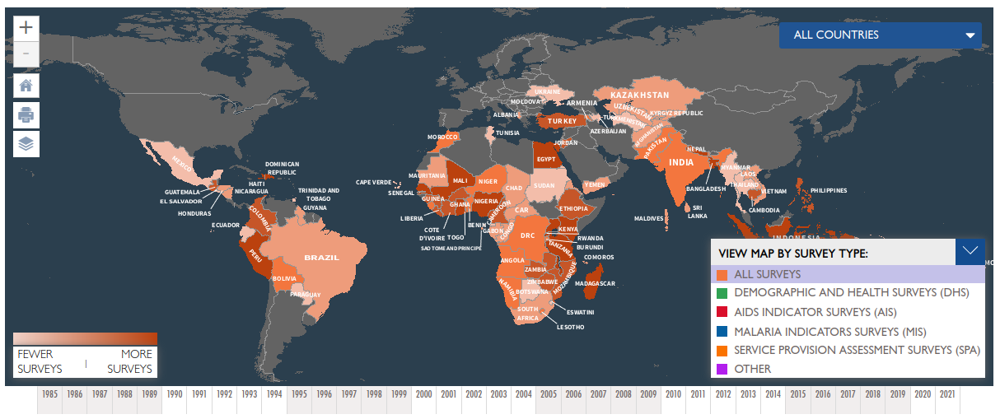
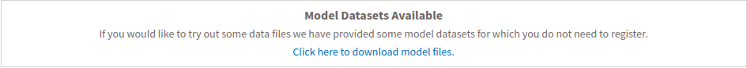

```{r setup, include=FALSE}

library(knitr)
library(rzine)

## Global options
options(max.print="75")
opts_chunk$set(echo=TRUE,
	             cache=FALSE,
               prompt=FALSE,
               tidy=FALSE,
               comment=NA,
               message=FALSE,
               warning=FALSE,
               class.source="bg-info",
               class.output="bg-warning")

# opts_knit$set(width=75)
```


# The DHS Program {-}

Le [programme DHS](https://www.dhsprogram.com/) est un programme d'enquêtes démographiques et de santé (EDS) de l'[United States Agency for International Development](https://www.usaid.gov/).

**Ce programme a collecté, analysé et diffuse des données précises et représentatives sur la population, la santé, le VIH et la nutrition à travers plus de 400 enquêtes dans plus de 90 pays, depuis plus de 30 ans :**

```{r,  echo=FALSE, out.width="100%",  fig.align = 'center'}

```

</br>

## Couverture du Bénin

Le Bénin fait partie des [pays ciblés par les enquêtes](https://dhsprogram.com/Countries/). Dans le cadre de ce programme, [**l'enquête standard DHS a été réalisées 5 fois**](https://dhsprogram.com/methodology/survey-search.cfm?sendsearch=1&str1=52&crt=1&listgrp=3) sur ce pays, aux dates suivantes : **1996**, **2001**, **2006**, **2011-2012**, **2017-2018**.

Voici un aperçu de **quelques indicateurs collectés** (valeur nationnale) et leur **disponibilité par dates** :

```{r,  echo=FALSE}

library(xlsx)
Benin_indicator <- read.xlsx(file = "figures/STATcompilerExport2021916_1595.xlsx", 
                             sheetIndex = 1,
                             startRow = 4,
                             endRow = 34)

Benin_indicator <- Benin_indicator[, c(1,  8:4)]
colnames(Benin_indicator) <- c("Indicator",
                               "1996",
                               "2001",
                               "2006",
                               "2011-2012",
                               "2017-2018")

library(DT)
datatable(Benin_indicator, options = list(
                                        autoWidth = TRUE, 
                                        rownames = FALSE,
                                        pageLength =NULL))
```

<div class="alert alert-danger" role="alert">
Il semblerait que **la localisation GPS des individus enquêtés ne soit pas disponible pour 2006**.</div>

</br>

# Accès aux données

L'accées aux données est gratuite, mais **il est obligatoire de** [**réaliser une demande justifiée**](https://dhsprogram.com/data/new-user-registration.cfm) **pour avoir d'un compte utilisateur permettant le téléchargement des données individuelles**.

<div class="alert alert-danger" role="alert">
**Seules des données aggrégés à des niveaux régionaux (départements pour le Bénin) sont accessibles sans création de compte** [**(cf partie 1.2)**](#indicateurs-disponibles).</div>

## Jeu de données exemple

**Néanmoins, le programme DHS a créé des exemples d'ensembles de données individuelles avec lesquels les utilisateurs peuvent s'exercer**. Ces ensembles de données ont été créés strictement pour la pratique et ne représentent pas les données réelles d'un pays. Ces ensembles de données sont basés sur le questionnaire *DHS6* et *Recode*. **Vous n'avez pas besoin de vous inscrire pour télécharger ces données.**


```{r,  echo=FALSE, out.width="100%",  fig.align = 'center', fig.cap="https://dhsprogram.com/data/Download-Model-Datasets.cfm"}

```


Les exemples exemples d'ensembles de données sont mis à disposition dans **quatre formats** :   
- *Stata dataset (.dta)*      
- *Flat ASCII data (.dat)*     
- *SAS dataset (.sas7bdat)*     
- *SPSS dataset (.sav)*    

Et parfois en *Hierarchical ASCII data (.dat)*

Les données sont proposées aux téléchargement par groupes d'individus ou thématiques :    
- Births   
- Couple   
- Household   
- Individual   
- Children   
- Men   
- Household member   
- HIV Test results   


```{r,  eval= FALSE, echo=FALSE}

library(haven)
data_ex <- read_sav("extract_spss/ZZBR62FL.SAV")

```

</br>

## Indicateurs disponibles

**Le package R** [**rdhs**](https://docs.ropensci.org/rdhs/), développé par OJ.. Watson & J. Eaton et soutenu par [rOpenSCi](https://ropensci.org/), **permet d'accéder directement aux données avec R**. 

**Ce package fournit un client pour :**    

1) **Interroger l'API des donnèes DHS** pour les indicateurs et les métadonnées d'enquête   
2) **Identifier les enquêtes et les ensembles de données** pour l'analyse   
3) **Télécharger les ensembles de données d'enquête** à partir du site Web de l'EDS   
4) **Charger les ensembles de données et les métadonnées associées** dans R   
5) **Extraire les variables et combiner les ensembles de données** pour une analyse groupée l'accessibilité de ces ensembles de données pour l'analyse statistique avec R    

<div class="alert alert-danger" role="alert">
**Il n'est pas nécéssaire d'avoir une compte utlisateur pour les étapes 1 et 2.** Il est donc possible d'explorer les données mises à disposition via R, sans s'enregistrer auprès du programme DHS</div>

</br>

### Le package rdhs

Pour récupérer à la table complète des indicateurs disponibles et à leurs caractèristiques :

```{r,  eval= TRUE}

# install.packages("rdhs")  
library(rdhs)

## what are the indicators ?
indicators <- dhs_indicators()

```

**Ci dessous, la liste des indicateurs (ID + définition) :**    

```{r,  eval= TRUE, echo=FALSE}


datatable(indicators[,c(7,1)], options = list(
                                        autoWidth = TRUE, 
                                        rownames = FALSE,
                                        pageLength = 5))

```


</br>

### Donnèes pour le Bénin ?

Pour récuperer les **indicateurs par enquête (date) disponibles pour le Bénin ainsi que leurs valeurs aggréger à un niveau infra-nationnal**, il suffit d'utiliser la fonction *dhs_data()* :

```{r,  eval= TRUE}

# Make an api request
resp <- dhs_data(surveyYearStart = 1990,
                 breakdown = "subnational",
                 countryIds = "BJ")

str(resp)

```

**Nombre d'indicateurs disponibles par enquête pour le Bénin :**

```{r,  eval= TRUE}

# Group by Survey and indicator
temp <- aggregate(data = resp, Indicator ~ SurveyYearLabel + IndicatorId + IndicatorType, length)

# Count Number of indicator by survey
temp2 <- aggregate(data = temp, IndicatorId ~ SurveyYearLabel + IndicatorType, length)
colnames(temp2) <- c("Year_of_survey", "Type_Indicator", "Number_of_indicators_available")

# and plot the results
library(ggplot2)
ggplot(temp2, aes(x = Year_of_survey, y = Number_of_indicators_available, 
       fill = Type_Indicator)) +
  geom_bar(stat='identity')

```

**Nombre d'indicateurs disponibles à chaque date pour le Bénin (depuis 1996) :**

```{r,  eval= TRUE}


temp3 <- aggregate(data = temp, SurveyYearLabel ~ IndicatorId, length)
temp3 <- temp3[temp3$SurveyYearLabel>=5,]

# Nombre d'indicateurs présents à toutes les dates :
print(nrow(temp3))

```

### Donnèes aggréger pour le Bénin ?

Les donnèes individuelles aggéger aux départements du Bénin sont directement mis à disposition.

Exemple pour l'indicateur "Number of women age 15-49" (*FE_FRTY_W_NPG*), en 2012 : 

```{r,  eval= TRUE}

resp2 <- dhs_data(indicatorIds = "FE_FRTY_W_NPG", 
                 surveyYearStart = 2012, 
                 surveyYearEnd = 2012,
                 breakdown = "subnational", 
                 countryIds = "BJ")


unique(resp2$CharacteristicLabel)


```

Le données sont également aggrégées par couple de département.

<div class="alert alert-danger" role="alert">
**Il n'y a malheureusement pas de clef de jointure fournies dans ces extraction les relier facilement à une couche géographique...**

**Un table de correspondance est mis à disposition à ce** [**lien**]()
</div>


[Guide to DHS Statistics](https://dhsprogram.com/Data/Guide-to-DHS-Statistics/index.cfm)

### Package rdhs

### Liste des indicateurs

### Date d'enquête

# Accès aux données

## Example datasets

## Inscription


# Donnèes individuelles


## Présentation


## Partie A.4


# Bibliographie {-}

<div id="refs"></div>


# Annexes {-}


## Infos session  {-}

```{r session_info, echo=FALSE}
kableExtra::kable_styling(kable(sessionRzine()[[1]], row.names = F))
kableExtra::kable_styling(kable(sessionRzine()[[2]], row.names = F))
```


<br>

## Glossaire {- #endnotes}

```{js, echo=FALSE}

$(document).ready(function() {
  $('.footnotes ol').appendTo('#endnotes');
  $('.footnotes').remove();
});

```
