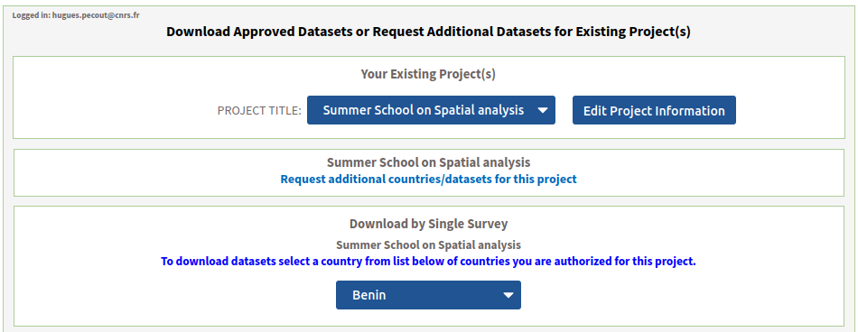
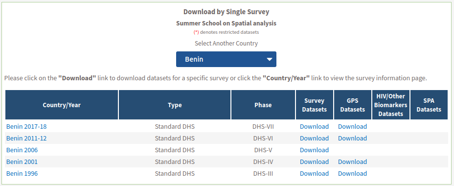
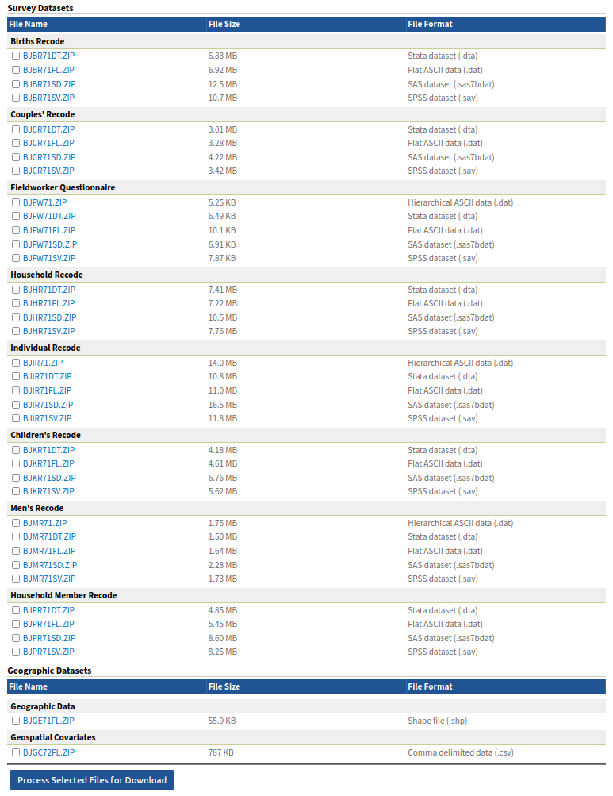
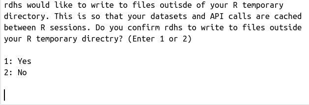
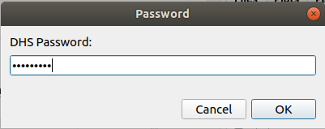
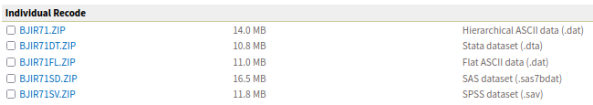

```{r setup, include=FALSE}

library(knitr)
library(rzine)

## Global options
options(max.print="75")
opts_chunk$set(echo=TRUE,
	             cache=FALSE,
               prompt=FALSE,
               tidy=FALSE,
               comment=NA,
               message=FALSE,
               warning=FALSE,
               class.source="bg-info",
               class.output="bg-warning")

# opts_knit$set(width=75)
```


# The DHS Program {-}

Le [programme DHS](https://www.dhsprogram.com/) est un programme d'enquêtes démographiques et de santé (EDS) de l'[United States Agency for International Development](https://www.usaid.gov/).

**Ce programme a collecté, analysé et diffuse des données précises et représentatives sur la population, la santé, le VIH et la nutrition à travers plus de 400 enquêtes dans plus de 90 pays, depuis plus de 30 ans :**

```{r,  echo=FALSE, out.width="100%",  fig.align = 'center', fig.cap='https://dhsprogram.com/Countries/index.cfm?show=map#activeType=_all&printStyle=false&mLon=12.8&mLat=11.7&mLev=2&title=Where%20We%20Work&desc='}
knitr::include_graphics("figures/carte_DHS.png")
```

</br>


# Les donnèes

L'accées aux données est gratuite, mais **il est obligatoire de** [**réaliser une demande justifiée**](https://dhsprogram.com/data/new-user-registration.cfm) **pour avoir d'un compte utilisateur permettant le téléchargement des données individuelles**.

<div class="alert alert-danger" role="alert">
**Seules des données aggrégés à des niveaux régionaux (départements pour le Bénin), et un jeu de données individuelles modèle (exemple) sont accessibles sans création de compte** [**(cf partie 1.2)**](#indicateurs-disponibles).</div>

</br>

## Questionnaire DHS

Beaucoup de documentation sur les méthodes d'enquête et les donnèes est mis à disposition : 


1) [**Guide to DHS Statistics** V7](https://dhsprogram.com/Data/Guide-to-DHS-Statistics/index.cfm)    
2) [**Modèle de questionnaire** V6](https://www.dhsprogram.com/publications/publication-dhsq6-dhs-questionnaires-and-manuals.cfm)    
3) [**Information sur les donnèes** V6](https://www.dhsprogram.com/publications/publication-dhsg4-dhs-questionnaires-and-manuals.cfm)   

</br>

## Jeu de données exemple

**Néanmoins, le programme DHS a créé des exemples d'ensembles de données individuelles avec lesquels les utilisateurs peuvent s'exercer**. Ces ensembles de données ont été créés strictement pour la pratique et ne représentent pas les données réelles d'un pays. Ces ensembles de données sont basés sur le questionnaire *DHS6* et *Recode*. **Vous n'avez pas besoin de vous inscrire pour télécharger ces données.**


```{r,  echo=FALSE, out.width="100%",  fig.align = 'center', fig.cap="https://dhsprogram.com/data/Download-Model-Datasets.cfm"}
knitr::include_graphics("figures/example.png")
```


Les exemples exemples d'ensembles de données sont mis à disposition dans **quatre formats** :   
- *Stata dataset (.dta)*      
- *Flat ASCII data (.dat)*     
- *SAS dataset (.sas7bdat)*     
- *SPSS dataset (.sav)*    

Et parfois en *Hierarchical ASCII data (.dat)*

Les données sont proposées aux téléchargement par groupes d'individus ou thématiques :    
- Births   
- Couple   
- Household   
- Individual   
- Children   
- Men   
- Household member   
- HIV Test results   


<div class="alert alert-danger" role="alert">
**La localisation GPS des individus ne semble pas être fournie dans le jeu de donnèes exemple...**</div>

</br>

### Import des données exemple

**-> Test d'import des donnèes "household" au format SPSS (.sav) :**

```{r,  eval= TRUE, echo=TRUE, cache=TRUE}

library(haven)
data_ex <- read_sav("model/zzhr62sv/ZZHR62FL.SAV")

```

</br>

### Liste des variables (avec label)

```{r,  eval= TRUE, echo=TRUE, cache=TRUE}

# AFFICHER LE LABEL D'UNE VARIABLE
attr(data_ex$HV028, "label")

# AFFICHER LES LABELS DE TOUTES LES VARIABLES (Code + label)
l <- lapply(data_ex, attr, "label")
l <- as.data.frame(l, stringsAsFactors = F)
list_var <- as.data.frame(t(l))

library(DT)
datatable(list_var, options = list(
                                        autoWidth = TRUE, 
                                        rownames = FALSE,
                                        pageLength =NULL))

```

</br>

### Liste des modalités (avec label)

```{r,  eval= TRUE, echo=TRUE, cache=TRUE}
# POUR UNE SEULE VARIABLE
attr(data_ex[["HV023"]], "labels")

# POUR TOUTES LES VARIABLES
library(sjlabelled)
get_labels(data_ex)

```

</br>

## Couverture du Bénin

Le Bénin fait partie des [pays ciblés par les enquêtes](https://dhsprogram.com/Countries/). Dans le cadre de ce programme, [**l'enquête standard DHS a été réalisées 5 fois**](https://dhsprogram.com/methodology/survey-search.cfm?sendsearch=1&str1=52&crt=1&listgrp=3) sur ce pays, aux dates suivantes : **1996**, **2001**, **2006**, **2011-2012**, **2017-2018**.

Voici un aperçu de **quelques indicateurs collectés** (valeur nationnale) et leur **disponibilité par dates** :

```{r,  echo=FALSE, cache=TRUE}

library(xlsx)
Benin_indicator <- read.xlsx(file = "figures/STATcompilerExport2021916_1595.xlsx", 
                             sheetIndex = 1,
                             startRow = 4,
                             endRow = 34)

Benin_indicator <- Benin_indicator[, c(1,  8:4)]
colnames(Benin_indicator) <- c("Indicator",
                               "1996",
                               "2001",
                               "2006",
                               "2011-2012",
                               "2017-2018")


datatable(Benin_indicator, options = list(
                                        autoWidth = TRUE, 
                                        rownames = FALSE,
                                        pageLength =NULL))
```

<div class="alert alert-danger" role="alert">
Il semblerait que **la localisation GPS des individus enquêtés ne soit pas disponible pour 2006**.</div>

</br>

## Indicateurs disponibles

**Le package R** [`rdhs`](https://docs.ropensci.org/rdhs/), développé par OJ.. Watson & J. Eaton et soutenu par [rOpenSCi](https://ropensci.org/), **permet d'accéder directement aux données avec R**. 

**Ce package fournit un client pour :**    

1) **Interroger l'API des donnèes DHS** pour les indicateurs et les métadonnées d'enquête   
2) **Identifier les enquêtes et les ensembles de données** pour l'analyse   
3) **Télécharger les ensembles de données d'enquête** à partir du site Web de l'EDS   
4) **Charger les ensembles de données et les métadonnées associées** dans R   
5) **Extraire les variables et combiner les ensembles de données** pour une analyse groupée l'accessibilité de ces ensembles de données pour l'analyse statistique avec R    

<div class="alert alert-danger" role="alert">
**Il n'est pas nécéssaire d'avoir une compte utlisateur pour les étapes 1 et 2.** Il est donc possible d'explorer les données mises à disposition via R, sans s'enregistrer auprès du programme DHS</div>

</br>


## Le package `rdhs`

**Ce package permet d'importer/requêter les données DHS directement avec R (API)**.
**Quelques ressources sur ce package :**   

- [CRAN - Aide officielle](https://cran.r-project.org/web/packages/rdhs/rdhs.pdf) 
- [Vignette - Anemia prevalence among women: an 'rdhs' example](https://cran.r-project.org/web/packages/rdhs/vignettes/anemia.html)  
- [Vignette - Downloading shape files for DHS surveys'= example](https://cran.r-project.org/web/packages/rdhs/vignettes/boundaries.html)     
- [Vignette - Using the rdhs client example](https://cran.r-project.org/web/packages/rdhs/vignettes/client.html)     
- [Vignette - Country Codes example](https://cran.r-project.org/web/packages/rdhs/vignettes/country_codes.html)     
- [Vignette - Interacting with geojson API results example](https://cran.r-project.org/web/packages/rdhs/vignettes/geojson.html)     
- [Vignette - https://cran.r-project.org/web/packages/rdhs/vignettes/testing.html example](https://cran.r-project.org/web/packages/rdhs/vignettes/testing.html)     

- [rdhs: an R package to interact with The Demographic and Health Surveys (DHS) Program datasets](https://www.researchgate.net/publication/334073531_rdhs_an_R_package_to_interact_with_The_Demographic_and_Health_Surveys_DHS_Program_datasets)     
- [rOpenSci - Interacting with The Demographic and Health Surveys (DHS) Program data](https://ropensci.org/blog/2019/01/29/rdhs/)     
- [asdfree.com](http://asdfree.com/demographic-and-health-surveys-dhs.html)      
- [rspatialdata](https://rspatialdata.github.io/dhs-data.html)      

Pour récupérer à la table complète des indicateurs disponibles et à leurs caractèristiques :

```{r,  eval= TRUE, cache=TRUE}

# install.packages("rdhs")  
library(rdhs)

## what are the indicators ?
indicators <- dhs_indicators()

```

**Ci dessous, la liste des indicateurs (ID + définition) :**    

```{r,  eval= TRUE, echo=FALSE, cache=TRUE}


datatable(indicators[,c(7,1)], options = list(
                                        autoWidth = TRUE, 
                                        rownames = FALSE,
                                        pageLength = 5))

```


</br>

### Indicateurs pour le Bénin ?

Pour récuperer les **indicateurs par enquête (date) disponibles pour le Bénin ainsi que leurs valeurs aggréger à un niveau infra-nationnal**, il suffit d'utiliser la fonction *dhs_data()* :

```{r,  eval= TRUE, cache=TRUE}

# Make an api request
resp <- dhs_data(surveyYearStart = 1990,
                 breakdown = "subnational",
                 countryIds = "BJ")

str(resp)

```

**Nombre d'indicateurs disponibles par enquête pour le Bénin :**

```{r,  eval= TRUE, cache=TRUE}

# Group by Survey and indicator
temp <- aggregate(data = resp, Indicator ~ SurveyYearLabel + IndicatorId + IndicatorType, length)

# Count Number of indicator by survey
temp2 <- aggregate(data = temp, IndicatorId ~ SurveyYearLabel + IndicatorType, length)
colnames(temp2) <- c("Year_of_survey", "Type_Indicator", "Number_of_indicators_available")

# and plot the results
library(ggplot2)
ggplot(temp2, aes(x = Year_of_survey, y = Number_of_indicators_available, 
       fill = Type_Indicator)) +
  geom_bar(stat='identity')

```

**Nombre d'indicateurs disponibles à chaque date pour le Bénin (depuis 1996) :**

```{r,  eval= TRUE, cache=TRUE}


temp3 <- aggregate(data = temp, SurveyYearLabel ~ IndicatorId, length)
temp3 <- temp3[temp3$SurveyYearLabel>=5,]

# Nombre d'indicateurs présents à toutes les dates :
print(nrow(temp3))

```

</br>

### Donnèes aggrégées pour le Bénin ?

**Les donnèes individuelles aggégées aux départements sont directement mis à disposition.**

Exemple pour l'indicateur "Total fertility rate 15-49" (*FE_FRTR_W_TFR*), en 2012 : 

```{r,  eval= TRUE, cache=TRUE}

resp2 <- dhs_data(indicatorIds = "FE_FRTR_W_TFR", 
                 surveyYearStart = 2012, 
                 surveyYearEnd = 2012,
                 breakdown = "subnational", 
                 countryIds = "BJ")


datatable(resp2[, c("CharacteristicLabel", "Value")], 
          options = list(autoWidth = TRUE, 
                         rownames = FALSE,
                         pageLength = 18))


```

Le données sont également aggrégées par couple de département.

<div class="alert alert-danger" role="alert">
**Il n'y a malheureusement pas de clef de jointure fournies dans ces extraction les relier facilement à une couche géographique...**

**Une table de correspondance est mis à disposition à ce** [**lien**](https://github.com/HuguesPecout/EXPLO_DHS_DATA/raw/main/table_passage_nom_ISO_Dep_Benin)</div>

Pour récupérer les géométries du découpage administratif du Bénin directement depuis R, il est possible d'utiliser le package `gadmr`


```{r,  eval= TRUE, cache=TRUE}

if(!require(remotes)) install.packages("remotes")
if(!require(gadmr)) remotes::install_github("SpatialWorks/gadmr")

library(gadmr)
# Téléchargement 
benin_sp <- get_geopackage(country = "BEN",  layer = 1)

# Conversion objet sp to sf
library(sf)
benin_sf <- st_as_sf(benin_sp)

# Chargement table de correspondance (à télécharger)
table <- readRDS("table_passage_nom_ISO_Dep_Benin")

# Merge avec la table de correspondance
benin_sf <- merge(benin_sf, table, by.x="HASC_1", by.y="ISO" )

# Merge avec les données
benin_sf <- merge(benin_sf, resp2, by.x="NAME_dhs", by.y="CharacteristicLabel" )

# Cartography
library(mapsf)
mf_theme("agolalight")
mf_map(benin_sf, var = "Value", type = "choro", leg_pos = "left")
mf_layout(title = "Total fertility rate 15-49, 2012",
          credits = "DHS program, 2012",
          scale = FALSE,
          arrow = TRUE,
          frame = TRUE)
mf_inset_on(x = "worldmap")
mf_worldmap(benin_sf)
mf_inset_off()


```

</br>


# Donnée individuelles

## S'enregistrer

Il est nécéssaire de faire une demande justifiée pour accéder aux données, en remplissant ce formulaire : [https://dhsprogram.com/data/new-user-registration.cfm](https://dhsprogram.com/data/new-user-registration.cfm).

<div class="alert alert-danger" role="alert">
**La  demande doit être précise (pays, thématique/analyse ciblé et pourquoi ?)**. **Les données ne peuvent être partagées**. Nous devons également les prevenir en cas de publication avec ces données.</div>


**Je donc fais une demande d'accèes à l'intégralité des données sur le Benin, coordonnées GPS incluses**. Ma demande, refusée dans un premier temps car pas assez précise à finalement été acceptée. Il m'ont demandé de m'engager par écrit que chaque participant/enseignant de l'école devra faire une demande d'accèes personnelle, même si la demande est identique pour tout le monde. **L'accèes à ces données a également été donné à Claude (claude.grasland@parisgeo.cnrs.fr)**.


## Accès aux données depuis le site

Nous pouvons récupérer les données en nous connectant sur cette [page](https://dhsprogram.com/data/dataset_admin/login_main.cfm?CFID=32453372&CFTOKEN=32609e957fb82381-24A0A2D0-BF76-4ACC-2E20E233ED8A9345).

L'extraction est nommée "**Summer Shcool on Spatial analysis**" :

```{r,  echo=FALSE, out.width="100%",  fig.align = 'center'}

```


```{r,  echo=FALSE, out.width="100%",  fig.align = 'center'}

```

**Huit fichiers sont mis à disposition** (pour chaque enquête/date) :

- **Birth**     
- **Couples**         
- **Fieldeworker questionnaire**       
- **Household**     
- **Individual**     
- **Children**     
- **Men**     
- **Household member**     

Des **fichiers de données géographiques** sont également téléchargeables :

```{r,  echo=FALSE, out.width="100%",  fig.align = 'center'}

```


## Accès aux données avec `rdhs`


Les package `rdhs` permet de télécharger directement les donnèes mises à disposition via R.

```{r,  eval= TRUE, cache=FALSE}

# if(!require(remotes)) install.packages("rdhs")

library(rdhs)

```


   

```{r DATA_OK,  eval=FALSE, echo= FALSE, cache=TRUE}

library(rdhs)
config <- set_rdhs_config(email = "hugues.pecout@cnrs.fr",
                project = "Summer School on Spatial analysis",
                config_path = "~/.rdhs.json",
                global = TRUE,
                verbose_download = TRUE)


```

### Informations d'identification

```{r,  eval=FALSE, cache=TRUE}

config <- set_rdhs_config(email = "hugues.pecout@cnrs.fr",
                project = "Summer School on Spatial analysis",
                config_path = "~/.rdhs.json",
                global = TRUE,
                verbose_download = TRUE)

```

Répondre à la question par **1** ou **2** (puis "Entrée") dans la console :

```{r,  echo=FALSE, out.width="65%",  fig.align = 'center'}

```

Une fenêtre pop-up s'ouvre pour **saisir le mot de passe** :

```{r,  echo=FALSE, out.width="45%",  fig.align = 'center'}

```


### Créer le 'coté client' 

Créer le 'coté client' de l'API qui pourra être appelé comme argument dans différentes fonctions du package** avec `client_dhs`. Cela crée un cache pour toutes les datasets téléchargés.


```{r,  eval=TRUE, echo=FALSE, cache=FALSE}

configuration <- get_rdhs_config()

```

```{r,  eval=TRUE, cache=FALSE}

client <- client_dhs(configuration)

```

### Lister les datasets

La liste (et le nom de fichiers) des datasets accessibles est consultable depuis votre compte  sur [dhsprogram.com](https://dhsprogram.com/). Exemple :

```{r,  echo=FALSE, out.width="90%",  fig.align = 'center'}

```

Mais, **il est également possible de lister tous les datasets (avec leur nom de code)** de la manière suivante avec la fonction `dhs_datasets`

```{r,  eval= TRUE, echo=TRUE, cache=TRUE}

library(rdhs)

# Séléction de l'ensemble des datasets sur le Bénin
dat <- dhs_datasets(countryIds="BJ")

```

Cela génére un tableau  dans lequel l'on peut repérer le nom des fichiers (***FilName***). Extrait :

```{r,  eval= TRUE, echo= FALSE, cache=TRUE}

library(DT)
datatable(dat[,c(3,1,6,9,12)], options = list(autoWidth = TRUE, 
                              rownames = FALSE,
                              pageLength =NULL))

``` 

### Télécharger un dataset 


Pour télécharger un jeu de données, utiliser `get_datasets()`.

Exemple avec le dataset "***Individual Recode***" de **2027-2018** en **format SPSS** (.sav) :

```{r,  eval= TRUE, echo= TRUE, cache=TRUE}

# Ecrire le nom du fichier ciblé
# Ou le numéro de ligne, ex : get_datasets(dat$FileName[167])
DHS_BJ_data17 <- get_datasets("BJIR71SV.ZIP")


```

Pareil le **dataset comportant les localisations GPS** en **2017-2018** en **format Flat ASCII ** (.dat) :

```{r,  eval= TRUE, echo= TRUE, cache=TRUE}

DHS_BJ_Geo17 <- get_datasets("BJGE71FL.ZIP")

```

Les donnèes sont alors téléchargées dans un fichier temporaire sur sa machine. Il ne reste plus qu'à les charger dans R.

### Importer un dataset dans R

Utiliser la fonction `readRDS()`

```{r,  eval= TRUE, echo= TRUE, cache=TRUE}

# Données d'enquête prétéléchargées
Data_BJ17 <- readRDS(DHS_BJ_data17$BJIR71SV)

# Données géographiques prétéléchargées
Geo_BJ17 <- readRDS(DHS_BJ_Geo17$BJGE71FL)

```


### Visualiser les coordonnées GPS

**Les données géographiques sont en format sp : Conversion en sf !**

```{r,  eval= TRUE, echo= TRUE, cache=TRUE}

library(sf)
Geo_BJ17 <- st_as_sf(x = Geo_BJ17)

```

**Visualisation des données géographiques :**

```{r,  eval=TRUE, echo=TRUE, cache=FALSE}

library(mapview)
mapview(Geo_BJ17)


```


</br>
</br>
</br>
</br>
</br>
</br>


DHS recode -> https://dhsprogram.com/publications/publication-dhsg4-dhs-questionnaires-and-manuals.cfm

Documentation sur le traitement spatial des données :   
- https://dhsprogram.com/pubs/pdf/SAR11/SAR11.pdf  

Documentation sur prevR package :     
- https://cran.r-project.org/web/packages/prevR/index.html    
- https://journals.openedition.org/cybergeo/24606   
- https://cran.r-project.org/web/packages/prevR/vignettes/intro_prevR.html   


# Bibliographie {-}

<div id="refs"></div>


# Annexes {-}


## Infos session  {-}

```{r session_info, echo=FALSE}
kableExtra::kable_styling(kable(sessionRzine()[[1]], row.names = F))
kableExtra::kable_styling(kable(sessionRzine()[[2]], row.names = F))


```


<br>


